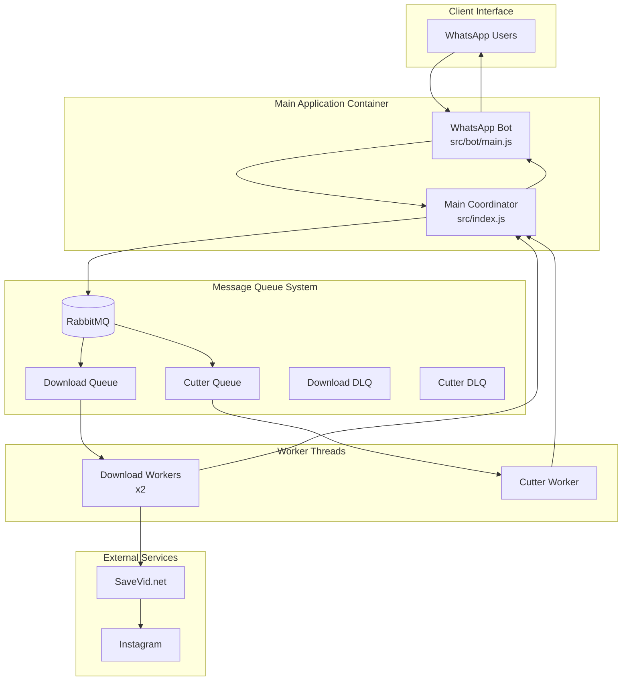

# WhatsApp Meme Downloader

A Node.js WhatsApp bot that downloads and processes memes from social media platforms using an event-driven architecture with worker threads and message queues. Currently supports Instagram posts and reels with video segmentation for WhatsApp status updates.

## 🏗️ System Architecture

This application uses a **microservices-oriented, event-driven architecture** with the following components:

- **WhatsApp Bot Client**: Interface for user commands and media delivery
- **Message Queue System**: RabbitMQ for asynchronous job processing
- **Worker Thread System**: Background processors for downloads and video processing
- **Web Scraper**: Puppeteer-based Instagram content extraction via SaveVid.net
- **Video Processor**: FFmpeg for segmentation and optimization



## ⚠️ Disclaimer

This project uses [WhatsApp Web.js](https://wwebjs.dev/), which connects to WhatsApp Web. While generally safe, there's always a risk of account restrictions. Use at your own discretion.

**Production Usage**: Successfully running since April 2024 without issues.

---

## 🚀 Quick Start

### Using Docker Compose (Recommended)

Clone the repository:

```bash
git clone https://github.com/Xarlie-Xarlie/whatsapp-meme-downloader.git
cd whatsapp-meme-downloader
```

Start all services:

```bash
docker-compose up -d
```

Monitor the bot initialization and get the QR code:

```bash
docker-compose logs -f wbot
```

When authenticated, you'll see: `Client is Ready!`

Your bot is now ready to download Instagram content!

---

## 🛠️ Local Development Setup

### Prerequisites

- Node.js 18+
- Google Chrome or Firefox
- RabbitMQ (via Docker recommended)

### Dependencies Installation

```bash
npm install
# or
yarn install
```

### Browser Configuration

Update `executablePath` in these files to match your local browser:

- `./src/bot/main.js`
- `./src/consumer/download_scraper.js`

**Example paths:**

- **Linux**: `/usr/bin/google-chrome` or `/usr/bin/firefox`
- **macOS**: `/Applications/Google Chrome.app/Contents/MacOS/Google Chrome`
- **Windows**: `C:\\Program Files\\Google\\Chrome\\Application\\chrome.exe`

### Start RabbitMQ

```bash
docker-compose up -d rabbitmq
```

### Run Application

```bash
npm start
```

---

## 🤖 Bot Commands

### Public Commands (Available to all users)

#### `!on`

Check if the bot is active and responding.

```
!on
→ "CharlieCharlie is here!"
```

#### `!download <url1> <url2> ...`

Download Instagram content and send it directly to you.

```bash
# Single URL
!download https://instagram.com/p/abc123

# Multiple URLs
!download https://instagram.com/reel/xyz789 https://instagram.com/p/def456
```

- **Supported URLs**: Instagram posts (`/p/`), reels (`/reel/`, `/reels/`)
- **Response**: Videos sent automatically after processing
- **Processing**: Downloads → Segments → Sends

#### `!download_noreply <url1> <url2> ...`

Download content without sending it back (save only).

```bash
!download_noreply https://instagram.com/reel/xyz789
→ "File downloaded: video_name.mp4"
```

- **Use case**: Batch downloading for later use
- **Response**: Confirmation with filename only

#### `!video <filename1> <filename2> ...`

Send previously downloaded videos by filename.

```bash
# Single file
!video my_video.mp4

# Multiple files
!video video1.mp4 video2.mp4 video3.mp4
```

- **Location**: Files from `./videos/` directory
- **Validation**: File must exist or error message sent

### Private Commands (Bot owner only)

#### `!status`

Send all downloaded videos segmented for WhatsApp status (30-second parts).

```bash
!status
→ Sends all videos as 30s segments sequentially
```

- **Authorization**: `fromMe` only (bot owner)
- **Segmentation**: Videos split into 30-second parts for status sharing
- **Example**: 1:15 video → three parts (30s + 30s + 15s)

#### `!stop`

Remotely stop the bot client.

```bash
!stop
→ Bot disconnects and stops
```

- **Authorization**: `fromMe` only (bot owner)
- **Effect**: Client disconnects, workers continue processing in background
- **Use case**: Emergency shutdown or maintenance

### File Upload Support

Send a text file containing URLs (one per line) with `!download` to batch process multiple links.

---

## 🔧 Core Technologies & Integrations

### Primary Stack

- **[Node.js](https://nodejs.org/)** - JavaScript runtime
- **[WhatsApp Web.js](https://wwebjs.dev/)** - WhatsApp client library
- **[RabbitMQ](https://rabbitmq.com/)** - Message queue system
- **[Puppeteer](https://pptr.dev/)** - Web scraping and automation
- **[FFmpeg](https://ffmpeg.org/)** - Video processing (via child processes)

### External Integrations

- **[SaveVid.net](https://savevid.net/)** - Instagram content extraction service
- **Instagram** - Source content platform

### Architecture Features

- **Event-Driven**: Asynchronous message processing
- **Worker Threads**: Parallel background processing
- **Dead Letter Queues**: Automatic retry mechanism for failed jobs
- **Containerized**: Docker Compose for easy deployment

---

## ⚙️ Worker System

The application uses Node.js worker threads for scalable background processing:

### Worker Types

- **Download Workers** (2 instances): Handle Instagram content extraction
- **Cutter Worker** (1 instance): Process video segmentation with FFmpeg

### Queue Management

- **download_queue**: New download requests
- **cutter_queue**: Video processing requests
- **download_queue_dlq**: Failed download retry queue
- **cutter_queue_dlq**: Failed processing retry queue

### Processing Flow

```
WhatsApp Command → Enqueue Job → Worker Processing → Result Notification → Response to User
```

### Auto-Recovery

Workers automatically restart on crashes with 5-second delay, ensuring system resilience.

---

## 🧪 Testing

This project uses [Node.js Test Runner](https://nodejs.org/api/test.html#test-runner) for testing.

**Run all tests:**

```bash
npm test
# or
yarn test
```

**Watch mode for development:**

```bash
npm run test:watch
# or
yarn test:watch
```

### Test Coverage

- **Unit Tests**: Core functionality (bot commands, queue operations, video processing)
- **E2E Tests**: End-to-end workflow validation
- **Integration Tests**: External service interactions

---

## 🚨 Troubleshooting

### Common Issues

#### Bot doesn't respond to commands

- Check WhatsApp Web connection: `docker-compose logs -f wbot`
- Verify RabbitMQ is running: `docker-compose ps`
- Ensure authentication is complete (look for "Client is ready!" message)

#### Download failures

- Instagram URL format: Must contain `/p/`, `/reel/`, or `/reels/`
- SaveVid.net service status: Temporary outages may occur
- Check worker logs: `docker-compose logs wbot`

#### Video processing issues

- FFmpeg dependency: Ensure FFmpeg is available in container
- File permissions: Check `./videos/` directory permissions
- Storage space: Verify adequate disk space

#### Local development issues

- Browser path: Update `executablePath` in bot and scraper files
- RabbitMQ connection: Ensure RabbitMQ is accessible on localhost:5672
- Port conflicts: Default ports 5672 (RabbitMQ) and 15672 (Management UI)

### Debug Commands

```bash
# Check container status
docker-compose ps

# View application logs
docker-compose logs -f wbot

# Access RabbitMQ management
# Open http://localhost:15672 (guest/guest)

# Monitor queue status
docker-compose exec rabbitmq rabbitmqctl list_queues
```

---

## 📚 Additional Documentation

For detailed technical documentation, see the `/docs` directory:

- **[Architecture Overview](./docs/architecture.md)** - System design and component interaction
- **[WhatsApp Bot](./docs/features/whatsapp-bot.md)** - Bot implementation details
- **[Queue System](./docs/features/queue-system.md)** - Message queue architecture
- **[Download System](./docs/features/download-system.md)** - Content extraction process
- **[Video Processing](./docs/features/video-processing.md)** - Segmentation and optimization

---

## 🤝 Contributing

1. Fork the repository
2. Create a feature branch
3. Follow existing code style (Prettier configured)
4. Add tests for new functionality
5. Update documentation as needed
6. Submit a pull request

---

## 📄 License

MIT License - see [LICENSE](LICENSE) file for details.

---

## 🙏 Acknowledgments

- [WhatsApp Web.js](https://wwebjs.dev/) team for the excellent WhatsApp client library
- [SaveVid.net](https://savevid.net/) for Instagram content extraction service
- Open source community for the supporting libraries and tools
