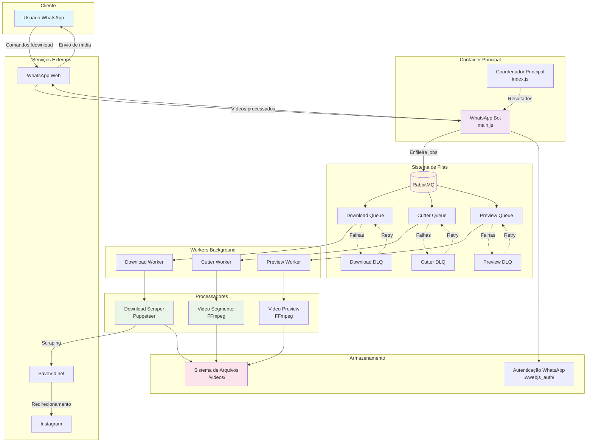

# Arquitetura do Sistema

## 🏗️ Visão Geral da Arquitetura

O WhatsApp Meme Downloader é uma aplicação Node.js baseada em microsserviços que utiliza arquitetura orientada a eventos com processamento assíncrono via filas. O sistema é projetado para ser escalável, resiliente e facilmente containerizável.

### Componentes Principais

- **Bot WhatsApp**: Cliente de interface com usuários
- **Sistema de Filas**: RabbitMQ para processamento assíncrono
- **Workers**: Processadores em background
- **Web Scraper**: Extração de vídeos de redes sociais
- **Processador de Vídeo**: Segmentação e otimização

## 🌐 Infraestrutura e Componentes Cloud

### Containerização
- **Docker**: Containerização da aplicação principal
- **Docker Compose**: Orquestração de serviços locais
- **Volumes**: Persistência de dados de autenticação e vídeos

### Componentes de Infraestrutura
- **RabbitMQ**: Message broker para filas de processamento
- **Sistema de Arquivos**: Armazenamento local de vídeos
- **Chrome/Firefox**: Browsers headless para web scraping

### Recursos Externos Utilizados
- **Google Chrome**: Browser para Puppeteer
- **FFmpeg**: Processamento de vídeo
- **Node.js Runtime**: Ambiente de execução

## 🔄 Diagrama de Arquitetura

## 🧩 Interação entre Componentes

### 1. Recepção de Comandos
- Usuários enviam comandos via WhatsApp
- Bot processa comandos e enfileira jobs
- Sistema de filas distribui trabalho

### 2. Processamento Assíncrono
- Workers consomem filas específicas
- Cada worker executa uma função especializada
- Resultados são comunicados via eventos

### 3. Gestão de Falhas
- Dead Letter Queues capturam falhas
- Sistema de retry automático
- Logs de erro para debugging

### 4. Fluxo de Dados
- Vídeos baixados são armazenados localmente
- Metadados mantidos em memória
- Estado de autenticação persistido

## 🏗️ Padrões Arquiteturais Utilizados

### Message-Driven Architecture
- Comunicação assíncrona via RabbitMQ
- Desacoplamento entre componentes
- Escalabilidade horizontal

### Worker Pattern
- Processamento em background
- Paralelização de tarefas
- Isolamento de falhas

### Event Sourcing (Simplificado)
- Eventos de resultado comunicados
- Estado reconstituído a partir de eventos
- Rastreabilidade de operações

## 🔧 Decisões Técnicas Importantes

### Escolha do WhatsApp Web.js
- **Prós**: API estável, boa documentação
- **Contras**: Dependente de mudanças do WhatsApp
- **Mitigação**: Versionamento fixo da API

### RabbitMQ como Message Broker
- **Prós**: Confiabilidade, recursos avançados de fila
- **Contras**: Complexidade adicional
- **Justificativa**: Necessário para processamento resiliente

### Puppeteer para Web Scraping
- **Prós**: JavaScript nativo, boa performance
- **Contras**: Consumo de recursos
- **Otimização**: Modo headless, pools de browsers

### FFmpeg para Processamento de Vídeo
- **Prós**: Ferramenta padrão da indústria
- **Contras**: Dependência externa
- **Integração**: Child processes com tratamento de erro