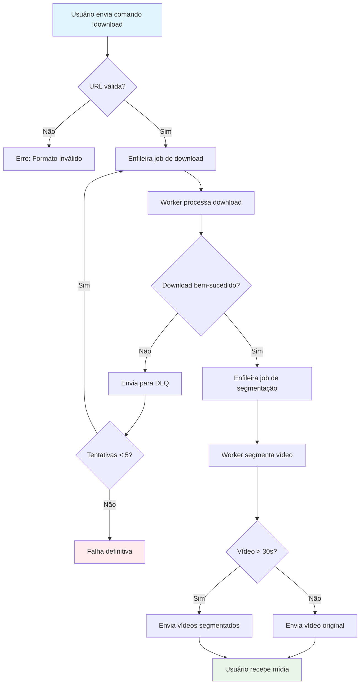
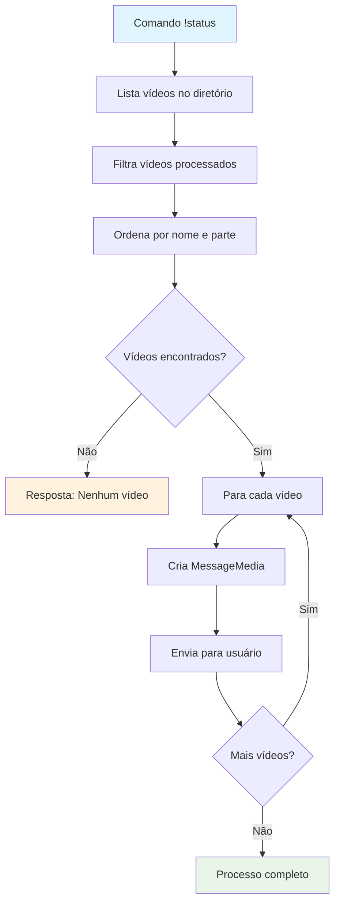

# Lógica de Negócio Central

## 💼 Visão Geral dos Processos de Negócio

O WhatsApp Meme Downloader implementa um modelo de negócio focado em automação de download e processamento de conteúdo de mídia social, especificamente vídeos do Instagram, através de uma interface conversacional via WhatsApp.

## 🎯 Propósito Central

**Missão**: Facilitar o download e compartilhamento de vídeos do Instagram de forma automatizada, processando-os para compatibilidade com diferentes usos (stories, posts, etc.).

**Valor Entregue**: 
- Download automatizado de vídeos
- Segmentação para status do WhatsApp (30s)
- Interface familiar via WhatsApp
- Processamento resiliente com retry

---

## 🔄 Principais Fluxos de Negócio

### 1. Fluxo de Download de Vídeo



### 2. Fluxo de Gestão de Status



---

## 🏗️ Modelo de Domínio

### **Entidades Principais**

#### 📹 **Vídeo (Video)**
- **Propriedades**:
  - `filePath`: Caminho do arquivo no sistema
  - `originalUrl`: URL original do Instagram
  - `duration`: Duração em segundos
  - `segments`: Lista de segmentos (se aplicável)
  - `downloadedAt`: Timestamp do download

- **Invariantes**:
  - Vídeos devem ter extensão .mp4
  - Duração deve ser > 0
  - FilePath deve existir no sistema de arquivos

#### 📱 **Comando WhatsApp (WhatsAppCommand)**
- **Propriedades**:
  - `type`: Tipo do comando (!download, !status, etc.)
  - `parameters`: Parâmetros do comando
  - `from`: ID do remetente
  - `timestamp`: Momento do recebimento

- **Invariantes**:
  - Tipo deve ser reconhecido pelo sistema
  - Remetente deve ser válido
  - Parâmetros devem estar no formato esperado

#### 🔄 **Job de Processamento (ProcessingJob)**
- **Propriedades**:
  - `queueName`: Nome da fila
  - `payload`: Dados do job
  - `retryCount`: Número de tentativas
  - `status`: Estado atual (pending, processing, completed, failed)

- **Invariantes**:
  - retryCount <= MAX_RETRIES (5)
  - payload deve conter dados necessários
  - queueName deve existir no sistema

### **Objetos de Valor**

#### 🎬 **Segmento de Vídeo (VideoSegment)**
- **Propriedades**:
  - `startTime`: Tempo inicial (segundos)
  - `endTime`: Tempo final (segundos)
  - `partNumber`: Número da parte
  - `filePath`: Caminho do segmento

#### 📊 **Resultado de Processamento (ProcessingResult)**
- **Propriedades**:
  - `success`: Sucesso/falha
  - `files`: Lista de arquivos gerados
  - `errorMessage`: Mensagem de erro (se aplicável)

### **Agregados**

#### 📦 **Sessão de Download (DownloadSession)**
- **Entidade Raiz**: Job de Download
- **Componentes**: 
  - Job original
  - Vídeos baixados
  - Jobs de segmentação resultantes
  - Histórico de tentativas

---

## 📋 Regras de Negócio Críticas

### **RN001 - Validação de URLs**
| Condição | Ação |
|----------|------|
| URL contém `/p/` | Aceitar como post do Instagram |
| URL contém `/reel/` ou `/reels/` | Aceitar como reel do Instagram |
| URL inválida | Rejeitar com mensagem de erro |

### **RN002 - Segmentação de Vídeos**
| Duração do Vídeo | Ação |
|------------------|------|
| ≤ 30 segundos | Enviar vídeo original |
| > 30 segundos | Segmentar em partes de 30s |
| Cada segmento | Máximo 30s, manter qualidade |

### **RN003 - Gestão de Falhas**
| Tentativa | Ação |
|-----------|------|
| 1ª a 5ª tentativa | Reprocessar automaticamente |
| Após 5ª tentativa | Marcar como falha definitiva |
| Falha definitiva | Notificar usuário |

### **RN004 - Autorização de Comandos**
| Comando | Restrição |
|---------|-----------|
| `!download` | Qualquer usuário |
| `!status` | Apenas remetente (`fromMe`) |
| `!stop` | Apenas remetente (`fromMe`) |
| `!video` | Qualquer usuário |

### **RN005 - Gestão de Armazenamento**
```
- Vídeos salvos em ./videos/
- Nome do arquivo baseado no ID do Instagram
- Segmentos nomeados como {nome}_part_{numero}.mp4
- Arquivos comprimidos excluídos da listagem
```

### **RN006 - Processamento de Filas**
```
- Cada fila processa apenas seu tipo específico
- Workers podem processar múltiplas instâncias
- DLQ mantém jobs falhados para retry
- Prefetch de 1 job por worker para balanceamento
```

---

## 🎮 Workflows Principais

### **Workflow 1: Download Simples**
1. **Entrada**: Comando `!download {url}`
2. **Validação**: Verificar formato da URL
3. **Enfileiramento**: Adicionar à `download_queue`
4. **Processamento**: Worker executa download via scraping
5. **Pós-processamento**: Enfileirar segmentação se necessário
6. **Entrega**: Enviar mídia processada ao usuário

### **Workflow 2: Download em Lote**
1. **Entrada**: Comando com múltiplas URLs ou arquivo de texto
2. **Parsing**: Extrair todas as URLs válidas
3. **Enfileiramento**: Criar job para cada URL
4. **Processamento Paralelo**: Workers processam simultaneamente
5. **Agregação**: Coletar resultados conforme completam
6. **Entrega**: Enviar cada vídeo quando pronto

### **Workflow 3: Gestão de Falhas**
1. **Detecção**: Erro durante processamento
2. **Categorização**: Determinar tipo de erro
3. **Retry Logic**: Verificar número de tentativas
4. **Reprocessamento**: Enviar de volta à fila se < 5 tentativas
5. **Notificação**: Informar usuário sobre falha definitiva

---

## 🔍 Invariantes do Sistema

### **Invariantes de Dados**
- Todo vídeo baixado deve ter arquivo correspondente no filesystem
- Segmentos devem manter ordem sequencial (part_0, part_1, etc.)
- Jobs devem sempre ter retryCount válido (0-5)

### **Invariantes de Estado**
- Cliente WhatsApp deve estar autenticado antes de processar comandos
- RabbitMQ deve estar disponível para enfileiramento
- Diretório de vídeos deve existir e ter permissões de escrita

### **Invariantes de Negócio**
- URLs devem ser do Instagram para processamento
- Vídeos > 30s sempre segmentados
- Comandos de gestão apenas por usuário autenticado

---

## 📈 Métricas de Sucesso

### **Métricas Operacionais**
- Taxa de sucesso de downloads (> 95%)
- Tempo médio de processamento (< 2 minutos)
- Taxa de retry (< 10%)

### **Métricas de Qualidade**
- Vídeos entregues sem corrupção (100%)
- Segmentação precisa em 30s
- Comandos reconhecidos corretamente (> 99%)

### **Métricas de Experiência**
- Tempo de resposta para comandos simples (< 5s)
- Disponibilidade do bot (> 99%)
- Clareza das mensagens de erro