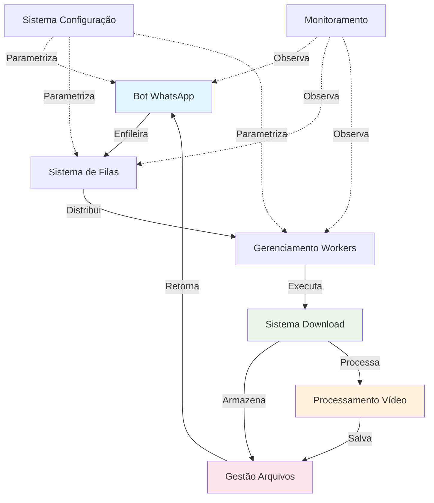

# Lista de Funcionalidades Principais

## ⚡ Visão Geral das Funcionalidades

O WhatsApp Meme Downloader oferece um conjunto focado de funcionalidades para download, processamento e entrega de vídeos do Instagram através de comandos via WhatsApp.

---

## 🤖 1. Bot do WhatsApp
**Finalidade**: Interface principal com usuários através do WhatsApp Web

### Características Principais:
- ✅ Autenticação via QR Code
- ✅ Processamento de comandos de texto
- ✅ Envio de mídia (vídeos)
- ✅ Gestão de sessão persistente
- ✅ Respostas contextuais

### Comandos Suportados:
- `!on` - Verificação de status do bot
- `!download {url}` - Download de vídeo com envio
- `!download_noreply {url}` - Download sem envio automático
- `!video {filename}` - Envio de vídeo específico
- `!status` - Lista todos os vídeos baixados
- `!stop` - Desconexão do bot

**Local da lógica de negócio**: Interface conversacional e gestão de comandos

---

## 📥 2. Sistema de Download
**Finalidade**: Download automatizado de vídeos do Instagram usando web scraping

### Características Principais:
- ✅ Web scraping via Puppeteer
- ✅ Suporte a Posts e Reels do Instagram
- ✅ Download de múltiplas URLs simultaneamente
- ✅ Gestão de arquivos com nomes únicos
- ✅ Integração com SaveVid.net como intermediário

### Formatos Suportados:
- Instagram Posts (`/p/`)
- Instagram Reels (`/reel/`, `/reels/`)

**Local da lógica de negócio**: Aquisição e armazenamento de conteúdo

---

## ✂️ 3. Processamento de Vídeo
**Finalidade**: Segmentação e otimização de vídeos para diferentes usos

### Características Principais:
- ✅ Segmentação automática em partes de 30 segundos
- ✅ Preservação de qualidade original
- ✅ Detecção inteligente de duração
- ✅ Nomenclatura consistente de segmentos
- ✅ Otimização para WhatsApp Status

### Regras de Processamento:
- Vídeos ≤ 30s: Mantidos originais
- Vídeos > 30s: Segmentados automaticamente
- Formato de saída: MP4 com codec copy

**Local da lógica de negócio**: Preparação de conteúdo para entrega

---

## 🔄 4. Sistema de Filas
**Finalidade**: Processamento assíncrono e resiliente com gestão de falhas

### Características Principais:
- ✅ Filas especializadas por tipo de tarefa
- ✅ Dead Letter Queues para retry automático
- ✅ Processamento paralelo via workers
- ✅ Limite de tentativas configurável
- ✅ Balanceamento de carga automático

### Filas Implementadas:
- `download_queue` - Jobs de download
- `cutter_queue` - Jobs de segmentação  
- `preview_queue` - Jobs de preview (futuro)
- `*_dlq` - Filas de retry para falhas

**Local da lógica de negócio**: Orquestração e confiabilidade

---

## ⚙️ 5. Gerenciamento de Workers
**Finalidade**: Processamento em background com auto-recuperação

### Características Principais:
- ✅ Workers especializados por tarefa
- ✅ Auto-restart em caso de falha
- ✅ Comunicação via Worker Threads
- ✅ Isolamento de processos
- ✅ Escalabilidade horizontal

### Workers Disponíveis:
- **Download Worker**: Execução de downloads
- **Cutter Worker**: Segmentação de vídeos
- **Preview Worker**: Geração de previews

**Local da lógica de negócio**: Execução confiável de tarefas

---

## 📁 6. Gestão de Arquivos
**Finalidade**: Organização e acesso a vídeos processados

### Características Principais:
- ✅ Estrutura de diretórios organizada
- ✅ Nomenclatura baseada em ID do Instagram
- ✅ Listagem inteligente de arquivos
- ✅ Filtros para diferentes tipos de conteúdo
- ✅ Limpeza automática de temporários

### Organização:
```
./videos/
├── {instagram_id}0.mp4          # Vídeo original
├── {instagram_id}_part_0.mp4    # Primeiro segmento
├── {instagram_id}_part_1.mp4    # Segundo segmento
└── ...
```

**Local da lógica de negócio**: Persistência e recuperação de dados

---

## 🔧 7. Sistema de Configuração
**Finalidade**: Configuração centralizada e ambiente de execução

### Características Principais:
- ✅ Configuração via variáveis de ambiente
- ✅ Paths configuráveis para browsers
- ✅ Configuração de filas e conexões
- ✅ Parametrização de retry e timeouts
- ✅ Configuração de qualidade de vídeo

### Principais Configurações:
- Browser executables (Chrome/Firefox)
- Conexão RabbitMQ
- Diretórios de trabalho
- Limites de retry
- Configurações de rede

**Local da lógica de negócio**: Parametrização do sistema

---

## 📊 8. Monitoramento e Logs
**Finalidade**: Observabilidade e debugging do sistema

### Características Principais:
- ✅ Logs estruturados por componente
- ✅ Rastreamento de jobs e falhas
- ✅ Status de conexões externas
- ✅ Métricas de performance
- ✅ Alertas de erro

### Eventos Monitorados:
- Conexões e desconexões
- Jobs processados com sucesso
- Falhas e retries
- Comandos recebidos
- Operações de arquivo

**Local da lógica de negócio**: Observabilidade operacional

---

## 🔗 Interação entre Funcionalidades



---

## 🎯 Prioridade e Complexidade

| Funcionalidade | Prioridade | Complexidade | Status |
|---------------|------------|--------------|--------|
| Bot WhatsApp | Alta | Média | ✅ Ativo |
| Sistema Download | Alta | Alta | ✅ Ativo |
| Processamento Vídeo | Alta | Média | ✅ Ativo |
| Sistema Filas | Média | Alta | ✅ Ativo |
| Gerenciamento Workers | Média | Média | ✅ Ativo |
| Gestão Arquivos | Baixa | Baixa | ✅ Ativo |
| Sistema Configuração | Baixa | Baixa | ✅ Ativo |
| Monitoramento | Baixa | Baixa | ⚠️ Básico |

---

## 🚀 Funcionalidades Futuras (Roadmap)

### **Curto Prazo**
- 🔄 Preview de vídeos antes do download
- 📊 Dashboard de métricas
- 🔧 Configuração via comandos

### **Médio Prazo**  
- 🎭 Suporte a outras redes sociais (TikTok, Twitter)
- 👥 Sistema de usuários e permissões
- 📱 Interface web para gestão

### **Longo Prazo**
- ☁️ Deploy em cloud providers
- 🤖 IA para categorização de conteúdo
- 📈 Analytics avançados de uso