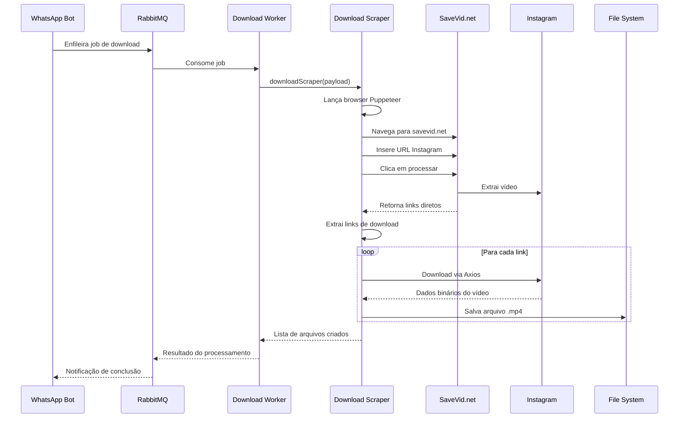
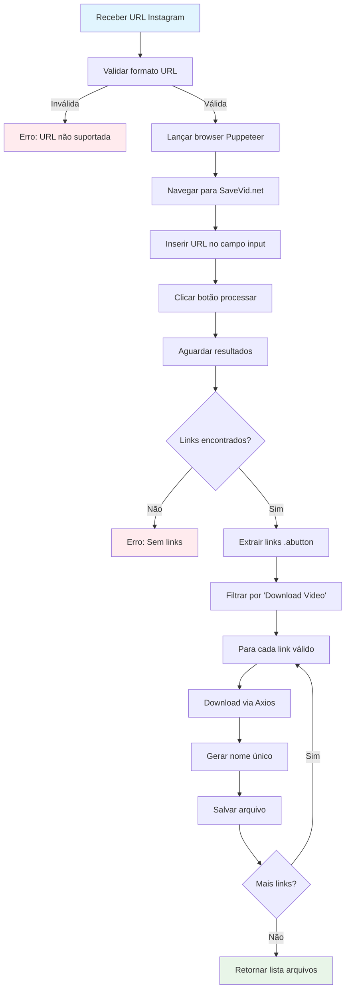
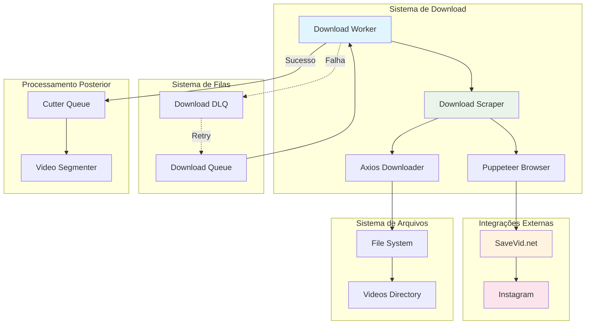

# Sistema de Download

## 📥 Visão Geral da Funcionalidade

O Sistema de Download é responsável pela aquisição automatizada de vídeos do Instagram através de web scraping. Utiliza técnicas de automação de browser para extrair links diretos de download e realizar o armazenamento local dos arquivos de mídia.

## 🏗️ Arquitetura e Posicionamento

### Posição na Arquitetura
- **Camada**: Lógica de Negócio/Integração
- **Responsabilidade**: Aquisição de conteúdo externo
- **Dependências**: Puppeteer, SaveVid.net, Axios, Sistema de Arquivos

### Módulos Relacionados
- `src/consumer/download_scraper.js` - Scraper principal
- `src/workers/download.js` - Worker de download
- `src/bot/enqueue_job.js` - Interface com sistema de filas
- `src/consumer/consumer.js` - Framework de consumo

## 🎯 Propósito e Lógica de Negócio

### Propósito Principal
Extrair e baixar vídeos do Instagram de forma automatizada, contornando limitações da API oficial através de web scraping inteligente e resiliente.

### Valor de Negócio
- ✅ **Automação**: Download sem intervenção manual
- ✅ **Escalabilidade**: Processamento paralelo de múltiplos downloads
- ✅ **Resiliência**: Retry automático em falhas
- ✅ **Flexibilidade**: Suporte a diferentes formatos de URL do Instagram

## 🔄 Fluxo de Trabalho Principal

### Processo de Download Completo



### Fluxo Detalhado de Scraping



## 📋 Componentes Técnicos Detalhados

### **Puppeteer Configuration**
```javascript
const browser = await puppeteer.launch({
  browser: 'firefox',
  headless: true,
  args: ['--no-sandbox', '--disable-setuid-sandbox'],
  executablePath: '/usr/bin/firefox'
});
```

### **Web Scraping Steps**
1. **Navegação**: `page.goto('https://savevid.net/en')`
2. **Input**: `page.type('input', link)`
3. **Processamento**: `page.click('.btn-default')`
4. **Extração**: `page.$$eval('.abutton', extractFunction)`

### **Download Implementation**
```javascript
async function downloadFile(href) {
  return axios.get(href, {
    responseType: 'arraybuffer'  // Para arquivos binários
  });
}

async function fileWrite(link, index, data) {
  const filePath = createFileName(link, index);
  await fs.writeFile(filePath, data);
}
```

## 🏗️ Modelo de Domínio da Funcionalidade

### **Entidades Principais**

#### 📥 **Job de Download (DownloadJob)**
- **Propriedades**:
  - `link`: URL original do Instagram
  - `retryCount`: Número de tentativas
  - `from`: ID do solicitante
  - `noreply`: Flag para envio automático

#### 🎬 **Vídeo Instagram (InstagramVideo)**
- **Propriedades**:
  - `originalUrl`: URL original
  - `instagramId`: ID extraído da URL
  - `downloadUrls`: URLs diretas extraídas
  - `filePaths`: Caminhos dos arquivos salvos
  - `downloadedAt`: Timestamp do download

#### 🔗 **Link de Download (DownloadLink)**
- **Propriedades**:
  - `url`: URL direta do vídeo
  - `quality`: Qualidade do vídeo (se disponível)
  - `fileSize`: Tamanho estimado

### **Objetos de Valor**

#### 📂 **Nome de Arquivo (FileName)**
```javascript
function createFileName(link, index) {
  if (link.includes('/p/')) {
    return `./videos/${link.split('/p/')[1].replace(/\/.*/, '')}${index}.mp4`;
  } else if (link.includes('/reel/')) {
    return `./videos/${link.split('/reel/')[1].replace(/\/.*/, '')}${index}.mp4`;
  } else if (link.includes('/reels/')) {
    return `./videos/${link.split('/reels/')[1].replace(/\/.*/, '')}${index}.mp4`;
  }
}
```

### **Regras de Negócio Específicas**

#### **RN-DL001**: Validação de URLs
| Padrão URL | Ação | Exemplo |
|------------|------|---------|
| `/p/{id}` | Aceitar como post | `instagram.com/p/ABC123/` |
| `/reel/{id}` | Aceitar como reel | `instagram.com/reel/XYZ789/` |
| `/reels/{id}` | Aceitar como reel | `instagram.com/reels/XYZ789/` |
| Outros | Rejeitar | Qualquer outro formato |

#### **RN-DL002**: Nomenclatura de Arquivos
- **Padrão**: `{instagram_id}{index}.mp4`
- **Index**: Sequencial a partir de 0
- **Diretório**: `./videos/`
- **Exemplo**: `ABC123.mp4`, `ABC1231.mp4`

#### **RN-DL003**: Gestão de Duplicatas
- **Verificação**: Verificar existência antes de salvar
- **Sobrescrita**: Permitida (arquivo será substituído)
- **Conflitos**: Último download prevalece

## 🔧 Dependências e Integrações

### **SaveVid.net Integration**
```javascript
const url = 'https://savevid.net/en';

// Processo de extração
await page.goto(url);
await page.type('input', link);
await page.click('.btn-default');
await page.waitForSelector('.abutton');

// Extração de links
const links = await page.$$eval('.abutton', (aTags) => {
  return aTags
    .filter((a) => a.title === 'Download Video')
    .map((a) => a.href);
});
```

### **Sistema de Filas**
```javascript
// Worker de download
import consumer from '../consumer/consumer.js';
import downloadScraper from '../consumer/download_scraper.js';

consumer('download_queue', downloadScraper, eventCallback);
```

### **Gestão de Falhas**
```javascript
// Dead Letter Queue para retry
import dlqConsumer from '../consumer/dlq_consumer.js';

dlqConsumer('download_queue_dlq', eventCallback);
```

## ⚠️ Casos Extremos e Tratamento de Erros

### **Cenários de Falha**

#### 1. **SaveVid.net Indisponível**
- **Detecção**: Timeout ou erro de navegação
- **Ação**: Enviar para DLQ para retry
- **Fallback**: Tentativas com delay exponencial

#### 2. **URL Instagram Inválida**
- **Detecção**: SaveVid.net não retorna links
- **Ação**: Marcar como falha definitiva
- **Log**: Registrar URL problemática

#### 3. **Falha de Download**
- **Detecção**: Erro no Axios ou arquivo corrompido
- **Ação**: Retry apenas este arquivo
- **Limite**: Máximo 5 tentativas por link

#### 4. **Espaço em Disco Insuficiente**
- **Detecção**: Erro de escrita no filesystem
- **Ação**: Interromper downloads e alertar
- **Recuperação**: Limpeza automática de temporários

### **Limitações e Contornos**

#### **Dependência Externa**
- **Problema**: SaveVid.net pode ficar indisponível
- **Contorno**: Sistema de retry com backoff
- **Monitoramento**: Alertas de falhas consecutivas
- **Futuro**: Múltiplos providers de scraping

#### **Rate Limiting**
- **Problema**: Instagram/SaveVid podem limitar requests
- **Contorno**: Delays entre requests
- **Implementação**: Pool de browsers com rotação

#### **Mudanças na Interface**
- **Problema**: SaveVid.net pode alterar seletores
- **Contorno**: Seletores genéricos quando possível
- **Manutenção**: Monitoramento de falhas de scraping

## 🎨 Fluxo de Integração com Outros Módulos



## 📊 Métricas e Monitoramento

### **Métricas de Performance**
```javascript
// Logs implementados
console.log(`File downloaded and saved to ${filePath}`);
console.error(`Error getting video duration: ${error.message}`);
```

### **KPIs do Sistema**
- **Taxa de Sucesso**: Downloads concluídos / Downloads tentados
- **Tempo Médio**: Duração desde enfileiramento até conclusão
- **Taxa de Retry**: Jobs que precisaram de nova tentativa
- **Disponibilidade Externa**: Uptime do SaveVid.net

### **Alertas Operacionais**
- ⚠️ Taxa de falha > 10%
- ⚠️ Tempo médio > 2 minutos
- ⚠️ SaveVid.net indisponível
- ⚠️ Espaço em disco < 1GB

## 🔮 Casos de Uso Avançados

### **Download em Lote**
```javascript
// Múltiplas URLs em um comando
const links = message.body.split(' ').slice(1);
links.forEach((link) => {
  enqueueJob('download_queue', {
    link: link,
    retryCount: 0,
    from: message.from,
    noreply: noreply
  });
});
```

### **Download de Arquivo de Texto**
```javascript
// Suporte a upload de arquivo com URLs
if (message.hasMedia && message.body.startsWith('!download')) {
  const media = await message.downloadMedia();
  const decodedText = atob(media.data);
  const lines = decodedText.split('\n');
  
  lines.forEach((line) => {
    enqueueJob('download_queue', { link: line, ... });
  });
}
```

## 🚀 Melhorias Futuras

### **Curto Prazo**
- 🔄 Pool de browsers para paralelização
- 📊 Métricas detalhadas de performance
- 🔧 Configuração de timeout por tipo de conteúdo

### **Médio Prazo**
- 🌐 Suporte a múltiplos providers de scraping
- 🤖 Detecção automática de qualidade de vídeo
- 📱 Suporte a outros tipos de mídia (imagens, stories)

### **Longo Prazo**
- 🧠 IA para otimização de rota de download
- ☁️ Integração com CDNs para cache
- 🔒 Bypass inteligente de anti-bot measures