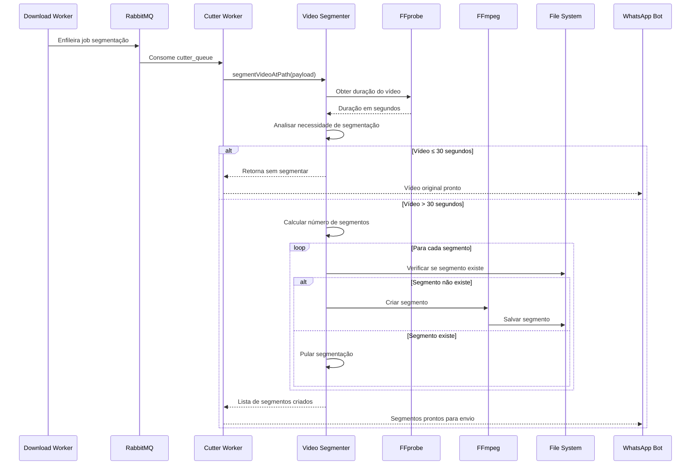

# Processamento de Vídeo

## ✂️ Visão Geral da Funcionalidade

O Sistema de Processamento de Vídeo é responsável pela segmentação, otimização e preparação de vídeos baixados para diferentes usos, especialmente para compatibilidade com WhatsApp Status (limitado a 30 segundos) e otimização de envio.

## 🏗️ Arquitetura e Posicionamento

### Posição na Arquitetura
- **Camada**: Lógica de Negócio/Processamento
- **Responsabilidade**: Transformação e otimização de mídia
- **Dependências**: FFmpeg, Sistema de Arquivos, Workers

### Módulos Relacionados
- `src/consumer/segment_video.js` - Segmentação principal
- `src/consumer/video_to_preview.js` - Geração de previews
- `src/workers/cutter.js` - Worker de segmentação
- `src/workers/video_preview.js` - Worker de preview
- `src/bot/list_status_videos.js` - Listagem inteligente

## 🎯 Propósito e Lógica de Negócio

### Propósito Principal
Transformar vídeos baixados em formatos otimizados para diferentes contextos de uso, garantindo compatibilidade com limitações do WhatsApp e melhor experiência do usuário.

### Valor de Negócio
- ✅ **Compatibilidade**: Vídeos prontos para WhatsApp Status
- ✅ **Otimização**: Redução de tempo de envio
- ✅ **Flexibilidade**: Múltiplos formatos de saída
- ✅ **Qualidade**: Preservação da qualidade original

## 🔄 Fluxo de Trabalho Principal

### Processo de Segmentação Completo



### Fluxo de Decisão de Processamento

```mermaid
flowchart TD
    A[Vídeo baixado] --> B[Obter duração via FFprobe]
    B --> C{Duração ≤ 30s?}
    C -->|Sim| D[Manter vídeo original]
    C -->|Não| E[Calcular número de segmentos]
    E --> F[Segmentos = ceil(duração/30)]
    F --> G[Para cada segmento]
    G --> H{Arquivo já existe?}
    H -->|Sim| I[Pular segmentação]
    H -->|Não| J[Criar comando FFmpeg]
    J --> K[Executar segmentação]
    K --> L[Salvar segmento]
    L --> M{Mais segmentos?}
    M -->|Sim| G
    M -->|Não| N[Listar arquivos criados]
    I --> M
    D --> O[Enviar original]
    N --> P[Enviar segmentos]
    
    style A fill:#e1f5fe
    style O fill:#e8f5e8
    style P fill:#e8f5e8
```

## 📋 Implementação Técnica Detalhada

### **Detecção de Duração com FFprobe**
```javascript
async function getVideoDuration(inputPath) {
  return new Promise((resolve, reject) => {
    const command = `ffprobe -v error -show_entries format=duration -of default=noprint_wrappers=1:nokey=1 ${inputPath}`;
    
    child_process.exec(command, (error, stdout, stderr) => {
      if (error) {
        console.error(`Error getting video duration: ${error.message}`);
        reject(error);
        return;
      }
      const duration = parseFloat(stdout.trim());
      resolve(duration);
    });
  });
}
```

### **Segmentação com FFmpeg**
```javascript
const command = `ffmpeg -ss ${startTime} -i ${inputPath} -t ${endTime - startTime} -c copy ${segmentOutputPath}`;

// Parâmetros:
// -ss: Tempo inicial
// -i: Arquivo de entrada  
// -t: Duração do segmento
// -c copy: Cópia sem recodificação (preserva qualidade)
```

### **Nomenclatura de Segmentos**
```javascript
function generateSegmentName(fileName, partNumber) {
  return `${fileName}_part_${partNumber}.mp4`;
}

// Exemplo:
// Video: "ABC123.mp4" 
// Segmentos: "ABC123_part_0.mp4", "ABC123_part_1.mp4", etc.
```

## 🏗️ Modelo de Domínio da Funcionalidade

### **Entidades Principais**

#### ✂️ **Tarefa de Segmentação (SegmentationTask)**
- **Propriedades**:
  - `filePath`: Caminho do vídeo original
  - `duration`: Duração total em segundos
  - `segmentDuration`: Duração de cada segmento (30s)
  - `outputDirectory`: Diretório de saída
  - `segments`: Lista de segmentos criados

#### 🎬 **Segmento de Vídeo (VideoSegment)**
- **Propriedades**:
  - `partNumber`: Número sequencial do segmento
  - `startTime`: Tempo inicial (segundos)
  - `endTime`: Tempo final (segundos)
  - `filePath`: Caminho do arquivo segmentado
  - `duration`: Duração real do segmento

#### 📊 **Análise de Vídeo (VideoAnalysis)**
- **Propriedades**:
  - `originalPath`: Caminho do arquivo original
  - `duration`: Duração total
  - `needsSegmentation`: Boolean para necessidade de segmentação
  - `estimatedSegments`: Número estimado de segmentos

### **Objetos de Valor**

#### ⏱️ **Duração (Duration)**
```javascript
class Duration {
  constructor(seconds) {
    this.seconds = parseFloat(seconds);
    this.minutes = Math.floor(this.seconds / 60);
    this.remainingSeconds = this.seconds % 60;
  }
  
  needsSegmentation() {
    return this.seconds > 30;
  }
  
  calculateSegments() {
    return Math.ceil(this.seconds / 30);
  }
}
```

### **Regras de Negócio Específicas**

#### **RN-VP001**: Critério de Segmentação
| Duração do Vídeo | Ação | Justificativa |
|------------------|------|---------------|
| ≤ 30 segundos | Manter original | Compatível com WhatsApp Status |
| > 30 segundos | Segmentar em 30s | Otimizar para envio e uso |
| Último segmento | Duração variável | Evitar segmentos muito pequenos |

#### **RN-VP002**: Preservação de Qualidade
```bash
# Comando FFmpeg utilizado
ffmpeg -ss {start} -i {input} -t {duration} -c copy {output}

# -c copy: Evita recodificação, preserva qualidade
# Resultado: Segmentação sem perda de qualidade
```

#### **RN-VP003**: Gestão de Duplicatas
- **Verificação**: Antes de cada segmentação
- **Ação**: Pular se arquivo já existe
- **Log**: "Segment {name} already exists. Skipping."

#### **RN-VP004**: Nomenclatura Consistente
- **Padrão**: `{nome_original}_part_{numero}.mp4`
- **Numeração**: Sequencial a partir de 0
- **Zeros à esquerda**: Não utilizados (0, 1, 2...)

## 🔧 Dependências e Integrações

### **FFmpeg Integration**
```javascript
// Verificação de instalação
const ffmpegCommand = 'ffmpeg -version';
const ffprobeCommand = 'ffprobe -version';

// Dockerfile
RUN apt-get install -y ffmpeg
```

### **Sistema de Workers**
```javascript
// Worker de segmentação
import consumer from '../consumer/consumer.js';
import segmentVideoAtPath from '../consumer/segment_video.js';

consumer('cutter_queue', segmentVideoAtPath, eventCallback);
```

### **Sistema de Arquivos**
```javascript
import fs from 'node:fs';
import path from 'node:path';

// Verificação de existência
if (fs.existsSync(segmentOutputPath)) {
  console.log(`Segment ${segmentFileName} already exists. Skipping.`);
  continue;
}
```

## 🎨 Integração com Listagem Inteligente

### **Filtragem e Ordenação**
```javascript
// src/bot/list_status_videos.js
function naturalSort(a, b) {
  const extractPartNumber = (str) => {
    const match = str.match(/_part_(\d+)/);
    return match ? parseInt(match[1]) : null;
  };
  
  const partNumberA = extractPartNumber(a);
  const partNumberB = extractPartNumber(b);
  
  // Ordenação por nome base e número de parte
  if (partNumberA < partNumberB) return -1;
  if (partNumberA > partNumberB) return 1;
  return 0;
}
```

### **Detecção de Vídeos Segmentados**
```javascript
function listStatusVideos(directory) {
  const files = fs.readdirSync(directory);
  let segmentedFiles = [];
  const originalFiles = {};
  
  files.forEach((file) => {
    const fileName = parse(file).name;
    const fileParts = fileName.split('_part_');
    
    if (fileParts.length > 1) {
      // É um segmento
      const baseName = fileParts[0] + extname(file);
      if (!originalFiles[baseName]) {
        originalFiles[baseName] = true;
        segmentedFiles.push(baseName); // Adiciona original uma vez
      }
      segmentedFiles.push(file); // Adiciona segmento
    } else {
      // Arquivo não segmentado
      segmentedFiles.push(file);
    }
  });
  
  return segmentedFiles
    .filter((file) => !originalFiles[file] && !file.includes('_compressed'))
    .map((file) => directory + file)
    .sort(naturalSort);
}
```

## ⚠️ Casos Extremos e Tratamento de Erros

### **Cenários de Falha**

#### 1. **FFmpeg Não Instalado**
```javascript
// Detecção
child_process.exec('ffmpeg -version', (error) => {
  if (error) {
    console.error('FFmpeg not found. Please install FFmpeg.');
    process.exit(1);
  }
});
```

#### 2. **Arquivo Original Corrompido**
```javascript
// Tratamento durante obtenção de duração
if (stderr) {
  console.error(`ffprobe stderr: ${stderr}`);
  reject(new Error('Video file might be corrupted'));
}
```

#### 3. **Espaço Insuficiente**
```javascript
// Verificação antes da segmentação
try {
  const stats = fs.statSync(inputPath);
  const fileSize = stats.size;
  const availableSpace = getAvailableSpace('./videos/');
  
  if (availableSpace < fileSize * 2) {
    throw new Error('Insufficient disk space for segmentation');
  }
} catch (error) {
  console.error('Disk space check failed:', error);
}
```

#### 4. **Permissões de Arquivo**
```javascript
// Verificação de permissões
try {
  fs.accessSync(outputPath, fs.constants.W_OK);
} catch (error) {
  console.error('No write permission for output directory');
  throw error;
}
```

### **Recuperação e Fallbacks**

#### **Segmentação Parcial**
- **Problema**: Falha em um segmento específico
- **Ação**: Continuar com próximos segmentos
- **Log**: Registrar segmento problemático
- **Resultado**: Enviar segmentos válidos

#### **Formato Não Suportado**
- **Problema**: FFmpeg não consegue processar
- **Ação**: Enviar vídeo original
- **Log**: Registrar formato problemático
- **Fallback**: Sem processamento adicional

## 📊 Métricas e Monitoramento

### **Métricas de Processamento**
```javascript
// Logs implementados
console.log(`Video ${fileName} is less than or equal to 30 seconds. Skipping segmentation.`);
console.log(`Segmented ${fileName} into 30-second parts.`);
console.log(`Segment ${segmentFileName} already exists. Skipping.`);
```

### **KPIs do Sistema**
- **Taxa de Segmentação**: Vídeos segmentados / Vídeos processados
- **Tempo Médio de Segmentação**: Por segundo de vídeo original
- **Taxa de Aproveitamento**: Segmentos reutilizados vs. criados
- **Qualidade Preservada**: Verificação de integridade pós-segmentação

### **Alertas Operacionais**
- ⚠️ FFmpeg indisponível
- ⚠️ Tempo de segmentação > 5x duração original
- ⚠️ Taxa de falhas > 5%
- ⚠️ Espaço em disco < 2x maior arquivo

## 🔮 Casos de Uso Avançados

### **Processamento de Vídeos Longos**
```javascript
// Vídeo de 5 minutos (300s)
// Resultado: 10 segmentos de 30s cada
const duration = 300;
const segments = Math.ceil(duration / 30); // 10 segmentos

for (let i = 0; i < segments; i++) {
  const startTime = i * 30;
  const endTime = Math.min((i + 1) * 30, duration);
  // Último segmento: 270s-300s = 30s completos
}
```

### **Otimização de Qualidade**
```javascript
// Futura implementação com análise de qualidade
async function optimizeForWhatsApp(inputPath) {
  const analysis = await analyzeVideo(inputPath);
  
  if (analysis.bitrate > WHATSAPP_MAX_BITRATE) {
    return compressVideo(inputPath, WHATSAPP_OPTIMAL_SETTINGS);
  }
  
  return inputPath; // Usar original se já otimizado
}
```

## 🚀 Melhorias Futuras

### **Curto Prazo**
- 📊 Análise de qualidade pré-segmentação
- 🔧 Configuração de duração de segmento
- 📱 Diferentes perfis para diferentes tipos de conteúdo

### **Médio Prazo**
- 🎬 Geração de previews e thumbnails
- 🤖 Detecção automática de cenas para cortes inteligentes
- 📈 Otimização baseada em feedback de qualidade

### **Longo Prazo**
- 🧠 IA para otimização de pontos de corte
- ☁️ Processamento distribuído para vídeos muito longos
- 🎨 Aplicação de filtros e efeitos automáticos