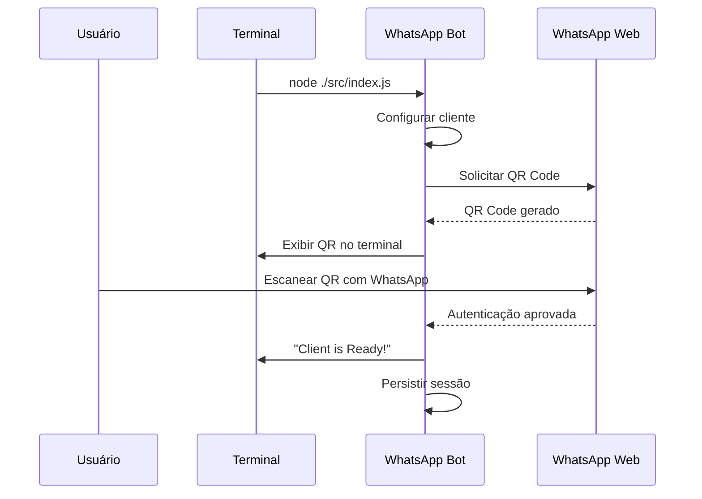
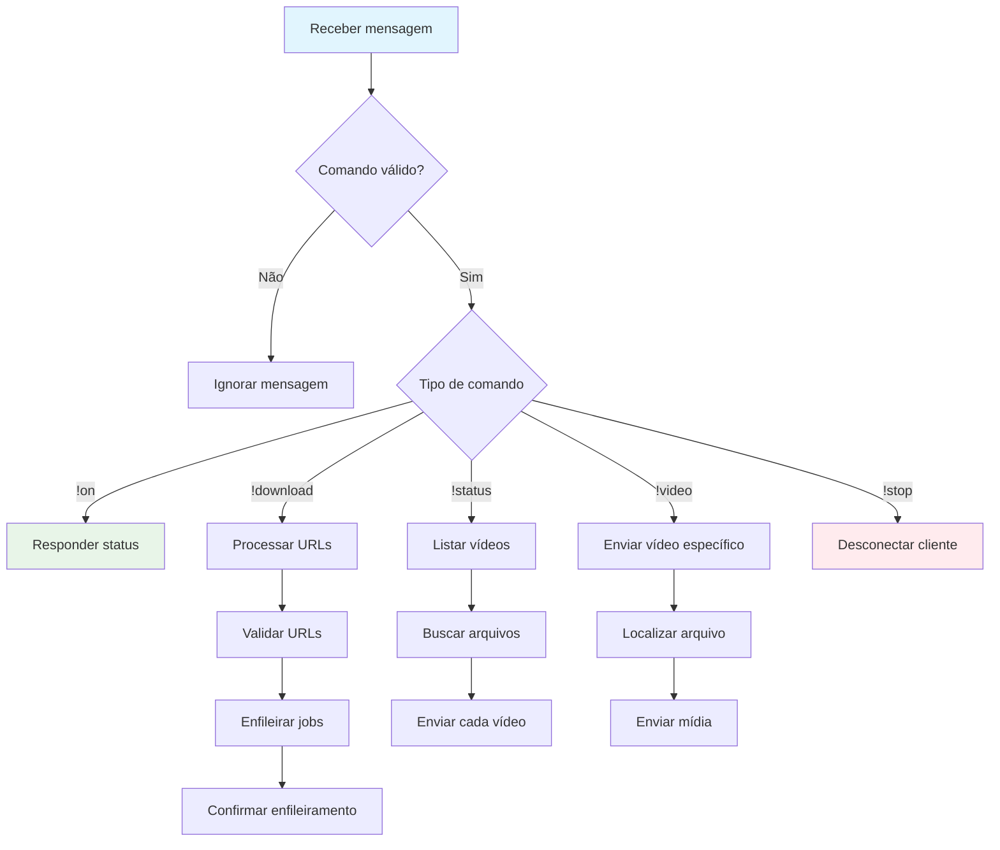
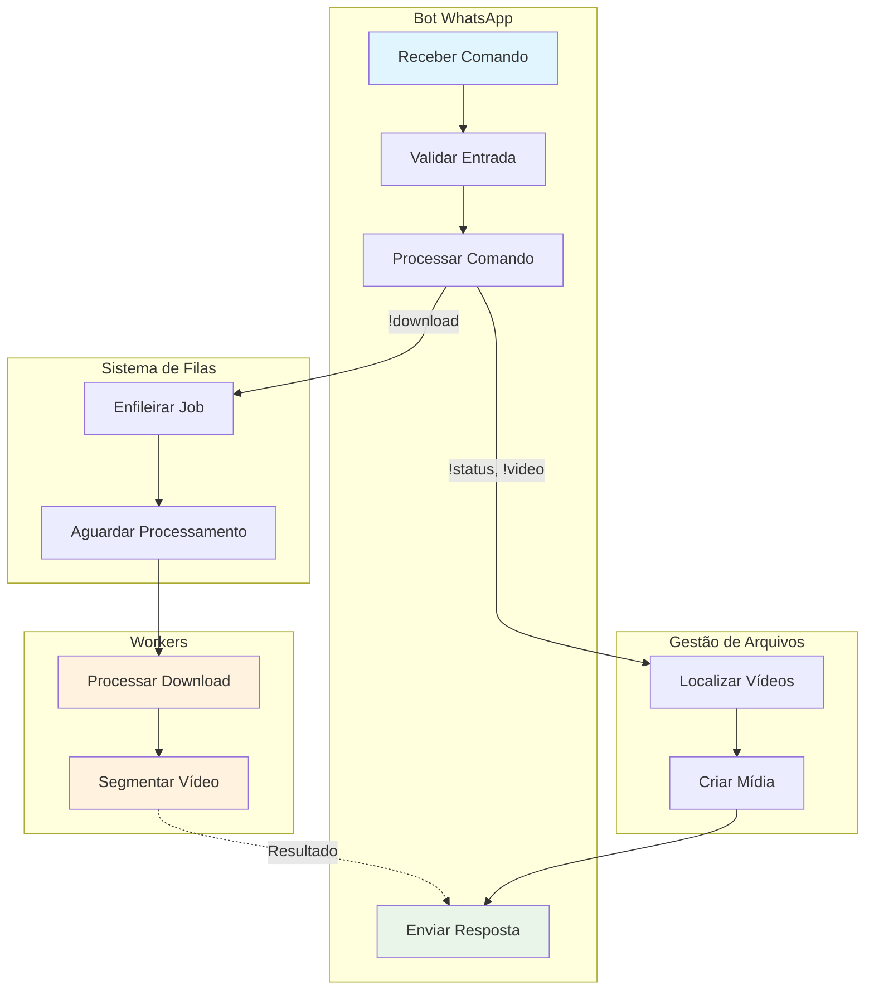

# Bot do WhatsApp

## 🤖 Visão Geral da Funcionalidade

O Bot do WhatsApp é o componente de interface principal do sistema, responsável por estabelecer comunicação direta com usuários através do WhatsApp Web. Atua como gateway de entrada para todos os comandos e ponto de saída para entrega de conteúdo processado.

## 🏗️ Arquitetura e Posicionamento

### Posição na Arquitetura
- **Camada**: Interface/Apresentação
- **Responsabilidade**: Gateway de comunicação bidirecional
- **Dependências**: WhatsApp Web API, Sistema de Filas, Gestão de Arquivos

### Módulos Relacionados
- `src/bot/main.js` - Cliente principal
- `src/bot/create_video_media.js` - Criação de mídia
- `src/bot/enqueue_job.js` - Interface com filas
- `src/bot/list_status_videos.js` - Listagem de vídeos
- `src/index.js` - Coordenação e resposta a eventos

## 🎯 Propósito e Lógica de Negócio

### Propósito Principal
Fornecer interface conversacional natural para usuários acessarem funcionalidades de download e gestão de vídeos do Instagram, mantendo experiência familiar do WhatsApp.

### Valor de Negócio
- ✅ **Acessibilidade**: Interface familiar (WhatsApp)
- ✅ **Simplicidade**: Comandos intuitivos de texto
- ✅ **Conveniência**: Sem necessidade de apps adicionais
- ✅ **Imediatismo**: Resposta em tempo real

## 🔄 Fluxos de Trabalho Principais

### 1. Inicialização e Autenticação



### 2. Processamento de Comandos



## 📋 Comandos Implementados

### **!on** - Verificação de Status
```javascript
// Uso: !on
// Resposta: "CharlieCharlie is here!"
```
- **Finalidade**: Confirmar que o bot está ativo
- **Autorização**: Qualquer usuário
- **Resposta**: Mensagem de confirmação

### **!download {url1} {url2} ...** - Download com Envio
```javascript
// Uso: !download https://instagram.com/p/abc123
// Resultado: Download + envio automático
```
- **Finalidade**: Baixar e enviar vídeos automaticamente
- **Autorização**: Qualquer usuário
- **Parâmetros**: Uma ou mais URLs do Instagram
- **Validação**: URLs devem conter `/p/`, `/reel/` ou `/reels/`

### **!download_noreply {url1} {url2} ...** - Download sem Envio
```javascript
// Uso: !download_noreply https://instagram.com/reel/xyz789
// Resultado: Download apenas, sem envio
```
- **Finalidade**: Baixar vídeos para uso posterior
- **Autorização**: Qualquer usuário
- **Resposta**: Nome do arquivo baixado

### **!status** - Listagem de Vídeos
```javascript
// Uso: !status
// Resultado: Envio de todos os vídeos processados
```
- **Finalidade**: Visualizar todos os vídeos baixados
- **Autorização**: Apenas remetente (`fromMe`)
- **Comportamento**: Envia vídeos segmentados em sequência

### **!video {filename1} {filename2} ...** - Envio Específico
```javascript
// Uso: !video meu_video.mp4
// Resultado: Envio do arquivo especificado
```
- **Finalidade**: Enviar vídeos específicos por nome
- **Autorização**: Qualquer usuário
- **Validação**: Arquivo deve existir em `./videos/`

### **!stop** - Desconexão
```javascript
// Uso: !stop
// Resultado: Bot desconecta e para
```
- **Finalidade**: Parar o bot remotamente
- **Autorização**: Apenas remetente (`fromMe`)
- **Comportamento**: Chama `client.destroy()`

## 🏗️ Modelo de Domínio da Funcionalidade

### **Entidades Principais**

#### 📱 **Cliente WhatsApp (WhatsAppClient)**
- **Propriedades**:
  - `sessionAuth`: Dados de autenticação persistidos
  - `isReady`: Status de conexão
  - `qrCode`: QR code para autenticação
  - `messageHandlers`: Manipuladores de comando

#### 🎬 **MessageMedia**
- **Propriedades**:
  - `mimetype`: Tipo de mídia ('video')
  - `data`: Dados binários em base64
  - `filename`: Nome do arquivo
  - `filesize`: Tamanho em bytes

#### 💬 **Comando (Command)**
- **Propriedades**:
  - `type`: Tipo do comando
  - `parameters`: Lista de parâmetros
  - `sender`: ID do remetente
  - `isFromMe`: Se enviado pelo próprio bot

### **Regras de Negócio Específicas**

#### **RN-BOT001**: Autorização de Comandos
| Comando | Restrição | Justificativa |
|---------|-----------|---------------|
| `!status` | Apenas `fromMe` | Evitar spam de vídeos |
| `!stop` | Apenas `fromMe` | Segurança operacional |
| Outros | Qualquer usuário | Funcionalidade pública |

#### **RN-BOT002**: Validação de URLs
```javascript
// URLs aceitas:
const validPatterns = [
  /\/p\/[^\/]+/,      // Posts: /p/abc123
  /\/reel\/[^\/]+/,   // Reels: /reel/xyz789  
  /\/reels\/[^\/]+/   // Reels: /reels/xyz789
];
```

#### **RN-BOT003**: Processamento de Lotes
- Máximo de URLs por comando: Ilimitado
- Processamento: Paralelo via filas
- Confirmação: Número de jobs enfileirados

## 🔧 Dependências e Integrações

### **WhatsApp Web.js**
```javascript
import { Client } from 'whatsapp-web.js';
import LocalAuth from 'whatsapp-web.js/src/authStrategies/LocalAuth.js';
```
- **Configuração**: Puppeteer com Chrome headless
- **Autenticação**: LocalAuth para persistência
- **WebVersion**: Versão fixa para estabilidade

### **Sistema de Filas**
```javascript
import enqueueJob from './enqueue_job.js';

// Enfileiramento de jobs
enqueueJob('download_queue', {
  link: url,
  retryCount: 0,
  from: message.from,
  noreply: isNoReply
});
```

### **Gestão de Mídia**
```javascript
import createVideoMedia from './create_video_media.js';

// Criação de objeto de mídia
const media = createVideoMedia(filePath);
await client.sendMessage(recipientId, media);
```

## 🎨 Fluxo de Interação com Outros Módulos



## ⚠️ Casos Extremos e Tratamento de Erros

### **Cenários de Erro**

#### 1. **URLs Inválidas**
```javascript
// Tratamento
try {
  const links = message.body.split(' ').slice(1);
  validateInstagramUrls(links);
} catch (e) {
  message.reply('Ensure your command is like: !download https://link1...');
}
```

#### 2. **Arquivo Não Encontrado** 
```javascript
// Tratamento para !video
try {
  const media = createVideoMedia(`./videos/${file}`);
  await client.sendMessage(message.from, media);
} catch (e) {
  client.sendMessage(message.from, `Error for file: ${file}!`);
}
```

#### 3. **Cliente Desconectado**
- **Detecção**: Eventos de erro do WhatsApp Web.js
- **Recuperação**: Reinicialização automática do cliente
- **Fallback**: Logs para debugging manual

### **Limitações e Contornos**

#### **Limitação do WhatsApp**
- **Problema**: Rate limiting da plataforma
- **Contorno**: Espaçamento natural entre envios
- **Monitoramento**: Logs de falhas de envio

#### **Tamanho de Arquivos**
- **Problema**: Limite de upload do WhatsApp (16MB)
- **Contorno**: Segmentação automática de vídeos
- **Validação**: Verificação antes do envio

## 📊 Métricas e Monitoramento

### **Métricas de Performance**
```javascript
// Exemplos de logs implementados
console.log('Client is ready!');
console.log(`Enqueued ${jobs} jobs`);
console.error(e);
```

### **Eventos Monitorados**
- ✅ Inicialização do cliente
- ✅ Comandos recebidos e processados
- ✅ Jobs enfileirados
- ✅ Erros de processamento
- ✅ Envios de mídia

### **Alertas Críticos**
- Falha de autenticação
- Perda de conexão com WhatsApp
- Falhas repetidas de envio
- Comandos malformados frequentes

## 🚀 Melhorias Futuras

### **Curto Prazo**
- 📊 Dashboard de comandos executados
- 🔧 Comandos de configuração dinâmica
- 📱 Suporte a outras mídias (imagens, áudio)

### **Médio Prazo**
- 🤖 Respostas mais inteligentes
- 👥 Sistema de usuários/grupos
- 📈 Analytics de uso por usuário

### **Longo Prazo**
- 🧠 Integração com IA para processamento de linguagem natural
- 🔗 Integração com outras plataformas de mensagem
- ☁️ Multi-instância para múltiplos números