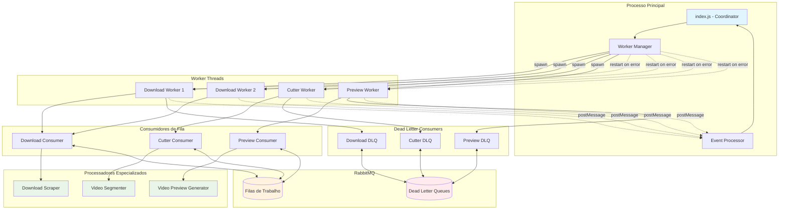
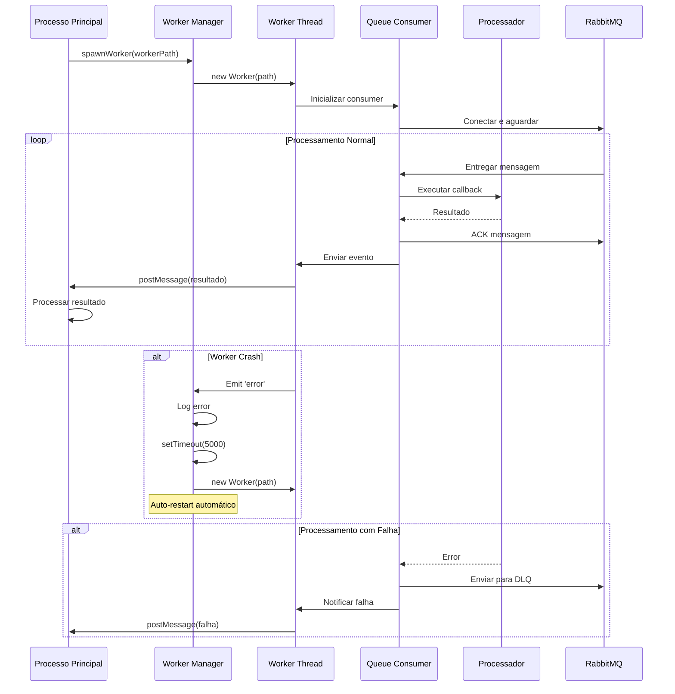

# Gerenciamento de Workers

## ⚙️ Visão Geral da Funcionalidade

O Sistema de Gerenciamento de Workers é responsável pela execução confiável de tarefas em background através de Worker Threads, garantindo processamento paralelo, isolamento de falhas e recuperação automática.

## 🏗️ Arquitetura e Posicionamento

### Posição na Arquitetura
- **Camada**: Infraestrutura/Processamento
- **Responsabilidade**: Execução paralela e confiável de tarefas
- **Dependências**: Worker Threads, Sistema de Filas, Processadores específicos

### Módulos Relacionados
- `src/workers/download.js` - Worker de download
- `src/workers/cutter.js` - Worker de segmentação
- `src/workers/video_preview.js` - Worker de preview
- `src/index.js` - Coordenação e spawn de workers
- `src/consumer/consumer.js` - Base de consumo

## 🎯 Propósito e Lógica de Negócio

### Propósito Principal
Garantir execução confiável e escalável de tarefas especializadas em background, com recuperação automática de falhas e comunicação eficiente com o processo principal.

### Valor de Negócio
- ✅ **Paralelização**: Múltiplas tarefas simultâneas
- ✅ **Isolamento**: Falhas não afetam outros workers
- ✅ **Recuperação**: Auto-restart em caso de crash
- ✅ **Especialização**: Workers otimizados para tarefas específicas

## 🔄 Arquitetura de Workers

### Estrutura do Sistema de Workers



### Fluxo de Vida de um Worker



## 📋 Implementação Técnica Detalhada

### **Worker Manager (Coordenador Principal)**
```javascript
// src/index.js
function spawnWorker(workerPath) {
  const worker = new Worker(workerPath);

  worker.on('message', (payload) => {
    processWorkerNotification(payload);
  });

  worker.on('error', (error) => {
    console.error(`Worker error: ${error}`);
    setTimeout(() => {
      console.log('spawning a new worker...');
      spawnWorker(workerPath);  // Auto-restart
    }, 5000);
  });

  return worker;
}

// Inicialização com delay para RabbitMQ
setTimeout(() => {
  spawnWorker('./src/workers/download.js');
  spawnWorker('./src/workers/download.js');  // 2 workers para download
  spawnWorker('./src/workers/cutter.js');
}, 10000);
```

### **Download Worker Implementation**
```javascript
// src/workers/download.js
import { parentPort } from 'node:worker_threads';
import consumer from '../consumer/consumer.js';
import downloadScraper from '../consumer/download_scraper.js';
import dlqConsumer from '../consumer/dlq_consumer.js';

const eventCallback = (payload) => {
  parentPort.postMessage(payload);
};

// Consumer principal
consumer('download_queue', downloadScraper, eventCallback);

// DLQ consumer para retry
dlqConsumer('download_queue_dlq', eventCallback);
```

### **Cutter Worker Implementation**
```javascript
// src/workers/cutter.js
import consumer from '../consumer/consumer.js';
import segmentVideoAtPath from '../consumer/segment_video.js';
import dlqConsumer from '../consumer/dlq_consumer.js';
import { parentPort } from 'node:worker_threads';

const eventCallback = (payload) => {
  parentPort.postMessage(payload);
};

consumer('cutter_queue', segmentVideoAtPath, eventCallback);
dlqConsumer('cutter_queue_dlq', eventCallback);
```

### **Event Processing Central**
```javascript
// src/index.js
function processWorkerNotification(payload) {
  const { queueName, filePath, from, noreply, link } = payload;

  switch (queueName) {
    case QUEUE_NAMES.DOWNLOAD:
      processDownloadQueue(payload.results, from, noreply);
      break;
    case QUEUE_NAMES.CUTTER:
      processCutterQueue(filePath, from, noreply);
      break;
    case QUEUE_NAMES.DOWNLOAD_DLQ:
      sendDownloadFailureMessage(from, link);
      break;
    case QUEUE_NAMES.CUTTER_DLQ:
      sendSegmentationFailureMessage(from, filePath);
      break;
    default:
      return;
  }
}
```

## 🏗️ Modelo de Domínio da Funcionalidade

### **Entidades Principais**

#### ⚙️ **Worker Thread (WorkerThread)**
- **Propriedades**:
  - `workerPath`: Caminho do arquivo do worker
  - `threadId`: ID único da thread
  - `status`: Estado atual (running, crashed, restarting)
  - `startTime`: Timestamp de inicialização
  - `lastActivity`: Última atividade registrada
  - `crashCount`: Número de crashes

#### 🔄 **Worker Pool (WorkerPool)**
- **Propriedades**:
  - `workers`: Lista de workers ativos
  - `maxWorkers`: Número máximo permitido
  - `strategy`: Estratégia de balanceamento
  - `healthCheck`: Status de saúde dos workers

#### 📨 **Worker Message (WorkerMessage)**
- **Propriedades**:
  - `type`: Tipo da mensagem (result, error, heartbeat)
  - `payload`: Dados da mensagem
  - `workerId`: ID do worker remetente
  - `timestamp`: Momento do envio

### **Objetos de Valor**

#### 🎯 **Worker Specialization (WorkerSpec)**
```javascript
const WorkerSpecializations = {
  DOWNLOAD: {
    path: './src/workers/download.js',
    queue: 'download_queue',
    instances: 2,  // Múltiplas instâncias
    processor: 'downloadScraper'
  },
  CUTTER: {
    path: './src/workers/cutter.js',
    queue: 'cutter_queue',
    instances: 1,
    processor: 'segmentVideoAtPath'
  },
  PREVIEW: {
    path: './src/workers/video_preview.js',
    queue: 'preview_queue',
    instances: 1,
    processor: 'createPreviewVideoAtPath'
  }
};
```

#### 📊 **Worker Status (WorkerStatus)**
```javascript
const WorkerStatus = {
  STARTING: 'starting',
  RUNNING: 'running',
  IDLE: 'idle',
  PROCESSING: 'processing',
  ERROR: 'error',
  CRASHED: 'crashed',
  RESTARTING: 'restarting'
};
```

### **Regras de Negócio Específicas**

#### **RN-WM001**: Auto-Restart de Workers
| Condição | Ação | Delay |
|----------|------|-------|
| Worker crash | Restart automático | 5 segundos |
| Múltiplos crashes | Restart com backoff | Exponencial |
| Error crítico | Restart imediato | 0 segundos |

#### **RN-WM002**: Especialização de Workers
| Worker Type | Responsabilidade | Instâncias |
|-------------|------------------|------------|
| Download | Web scraping e download | 2 (paralelização) |
| Cutter | Segmentação de vídeo | 1 (sequencial) |
| Preview | Geração de previews | 1 (baixa demanda) |

#### **RN-WM003**: Comunicação Worker-Main
```javascript
// Protocolo de mensagens
const MessageTypes = {
  RESULT: 'result',           // Resultado de processamento
  ERROR: 'error',             // Erro durante processamento
  HEARTBEAT: 'heartbeat',     // Sinal de vida
  METRICS: 'metrics'          // Métricas de performance
};
```

## 🔧 Configuração e Otimização

### **Worker Configuration**
```javascript
// Configuração dinâmica de workers
const workerConfig = {
  download: {
    instances: process.env.DOWNLOAD_WORKERS || 2,
    memory: '512MB',
    cpu: '0.5',
    restartPolicy: 'always'
  },
  cutter: {
    instances: 1,
    memory: '1GB',      // Mais memória para FFmpeg
    cpu: '1.0',         // CPU dedicada
    restartPolicy: 'on-failure'
  },
  preview: {
    instances: 1,
    memory: '256MB',
    cpu: '0.25',
    restartPolicy: 'unless-stopped'
  }
};
```

### **Resource Management**
```javascript
// Monitoramento de recursos
class WorkerResourceManager {
  constructor() {
    this.workers = new Map();
    this.metrics = new Map();
  }
  
  monitorWorker(workerId) {
    const usage = process.resourceUsage();
    this.metrics.set(workerId, {
      memory: usage.maxRSS,
      cpu: usage.userCPUTime + usage.systemCPUTime,
      timestamp: Date.now()
    });
  }
  
  shouldRestartWorker(workerId) {
    const metrics = this.metrics.get(workerId);
    if (!metrics) return false;
    
    // Critérios para restart
    return metrics.memory > MAX_MEMORY_USAGE ||
           metrics.cpu > MAX_CPU_USAGE ||
           (Date.now() - metrics.timestamp) > HEALTH_CHECK_TIMEOUT;
  }
}
```

## 🎨 Padrões de Comunicação

### **Message Passing Pattern**
```javascript
// Worker -> Main: Resultado de processamento
parentPort.postMessage({
  type: 'result',
  queueName: 'download_queue',
  payload: {
    results: ['file1.mp4', 'file2.mp4'],
    from: 'user123',
    noreply: false
  }
});

// Worker -> Main: Notificação de erro
parentPort.postMessage({
  type: 'error',
  queueName: 'download_queue_dlq',
  payload: {
    error: 'Download failed',
    link: 'https://instagram.com/p/abc123',
    from: 'user123'
  }
});
```

### **Event-Driven Communication**
```javascript
// Main process event handling
function processWorkerNotification(payload) {
  switch (payload.type) {
    case 'result':
      handleSuccessfulProcessing(payload);
      break;
    case 'error':
      handleProcessingError(payload);
      break;
    case 'heartbeat':
      updateWorkerHealth(payload.workerId);
      break;
    case 'metrics':
      recordWorkerMetrics(payload);
      break;
  }
}
```

## ⚠️ Casos Extremos e Tratamento de Erros

### **Cenários de Falha**

#### 1. **Worker Crash Súbito**
```javascript
// Detecção e recuperação
worker.on('error', (error) => {
  console.error(`Worker error: ${error}`);
  
  // Log detalhado para debugging
  logWorkerCrash({
    workerId: worker.threadId,
    error: error.message,
    stack: error.stack,
    timestamp: new Date().toISOString()
  });
  
  // Restart com delay
  setTimeout(() => {
    console.log('spawning a new worker...');
    spawnWorker(workerPath);
  }, 5000);
});
```

#### 2. **Memory Leak em Worker**
```javascript
// Monitoramento de memória
setInterval(() => {
  workers.forEach(worker => {
    const usage = worker.resourceUsage();
    if (usage.maxRSS > MEMORY_THRESHOLD) {
      console.warn(`Worker ${worker.threadId} using too much memory`);
      // Graceful restart
      restartWorkerGracefully(worker);
    }
  });
}, 30000); // Check a cada 30s
```

#### 3. **Deadlock em Processing**
```javascript
// Timeout para processamento
class WorkerTimeoutManager {
  constructor() {
    this.activeJobs = new Map();
  }
  
  startJob(workerId, jobId) {
    const timeout = setTimeout(() => {
      console.error(`Job ${jobId} timed out for worker ${workerId}`);
      this.killWorker(workerId);
    }, JOB_TIMEOUT);
    
    this.activeJobs.set(jobId, { workerId, timeout });
  }
  
  completeJob(jobId) {
    const job = this.activeJobs.get(jobId);
    if (job) {
      clearTimeout(job.timeout);
      this.activeJobs.delete(jobId);
    }
  }
}
```

#### 4. **RabbitMQ Connection Loss**
```javascript
// Reconnection logic no worker
class WorkerRabbitMQManager {
  constructor(worker) {
    this.worker = worker;
    this.reconnectAttempts = 0;
    this.maxReconnects = 10;
  }
  
  async handleConnectionLoss() {
    if (this.reconnectAttempts < this.maxReconnects) {
      const delay = Math.pow(2, this.reconnectAttempts) * 1000;
      await new Promise(resolve => setTimeout(resolve, delay));
      
      try {
        await this.reconnect();
        this.reconnectAttempts = 0;
      } catch (error) {
        this.reconnectAttempts++;
        await this.handleConnectionLoss();
      }
    } else {
      // Notificar main process para restart
      parentPort.postMessage({
        type: 'error',
        error: 'Unable to reconnect to RabbitMQ',
        restartRequired: true
      });
    }
  }
}
```

## 📊 Métricas e Monitoramento

### **Worker Health Metrics**
```javascript
// Métricas coletadas por worker
const workerMetrics = {
  jobsProcessed: 0,
  jobsSuccessful: 0,
  jobsFailed: 0,
  averageProcessingTime: 0,
  memoryUsage: process.memoryUsage(),
  uptime: process.uptime(),
  lastActivity: new Date()
};

// Envio periódico de métricas
setInterval(() => {
  parentPort.postMessage({
    type: 'metrics',
    workerId: process.pid,
    metrics: workerMetrics
  });
}, 60000); // A cada minuto
```

### **Performance Monitoring**
```javascript
// Dashboard de workers
class WorkerDashboard {
  constructor() {
    this.workerStats = new Map();
  }
  
  updateWorkerStats(workerId, metrics) {
    this.workerStats.set(workerId, {
      ...metrics,
      timestamp: Date.now()
    });
  }
  
  getOverallHealth() {
    const workers = Array.from(this.workerStats.values());
    return {
      totalWorkers: workers.length,
      activeWorkers: workers.filter(w => w.status === 'running').length,
      totalJobs: workers.reduce((sum, w) => sum + w.jobsProcessed, 0),
      successRate: this.calculateSuccessRate(workers),
      averageUptime: this.calculateAverageUptime(workers)
    };
  }
}
```

### **Alertas e Notificações**
```javascript
// Sistema de alertas
const alertConditions = {
  workerCrashRate: {
    threshold: 0.1,  // 10% de crashes
    action: 'ALERT_HIGH'
  },
  memoryUsage: {
    threshold: 0.8,  // 80% da memória
    action: 'ALERT_MEDIUM'
  },
  processingDelay: {
    threshold: 300000,  // 5 minutos
    action: 'ALERT_LOW'
  }
};
```

## 🚀 Otimizações e Melhorias Futuras

### **Curto Prazo**
- 📊 Dashboard em tempo real de workers
- 🔧 Configuração dinâmica de número de workers
- 📈 Métricas detalhadas de performance

### **Médio Prazo**
- 🎯 Load balancing inteligente entre workers
- 🔄 Graceful shutdown e restart
- 📦 Worker pooling com reutilização

### **Longo Prazo**
- ☁️ Workers distribuídos em múltiplas máquinas
- 🤖 Auto-scaling baseado em carga
- 🧠 Machine learning para otimização de recursos

### **Advanced Worker Management**
```javascript
// Futuras implementações
class AdvancedWorkerManager {
  constructor() {
    this.workerPools = new Map();
    this.loadBalancer = new WorkerLoadBalancer();
    this.healthMonitor = new WorkerHealthMonitor();
    this.autoScaler = new WorkerAutoScaler();
  }
  
  async createWorkerPool(spec) {
    const pool = new WorkerPool(spec);
    await pool.initialize();
    this.workerPools.set(spec.name, pool);
    return pool;
  }
  
  async scalePool(poolName, targetSize) {
    const pool = this.workerPools.get(poolName);
    if (pool) {
      await pool.scaleTo(targetSize);
    }
  }
  
  async distributeJob(job) {
    const optimalWorker = this.loadBalancer.selectWorker(job);
    return optimalWorker.execute(job);
  }
}
```